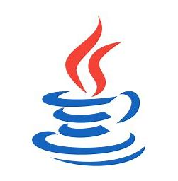
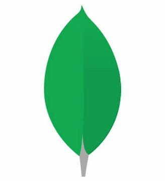

### Hi there, I'm Jackal 👋

- 🔭 I’m currently working on ReactJS and VueJS projects.
- 🌱 I’m currently learning JAVA.
- ⚡ Fun fact: I love UI design and Video games.

### Languages and Tools:

 
 

